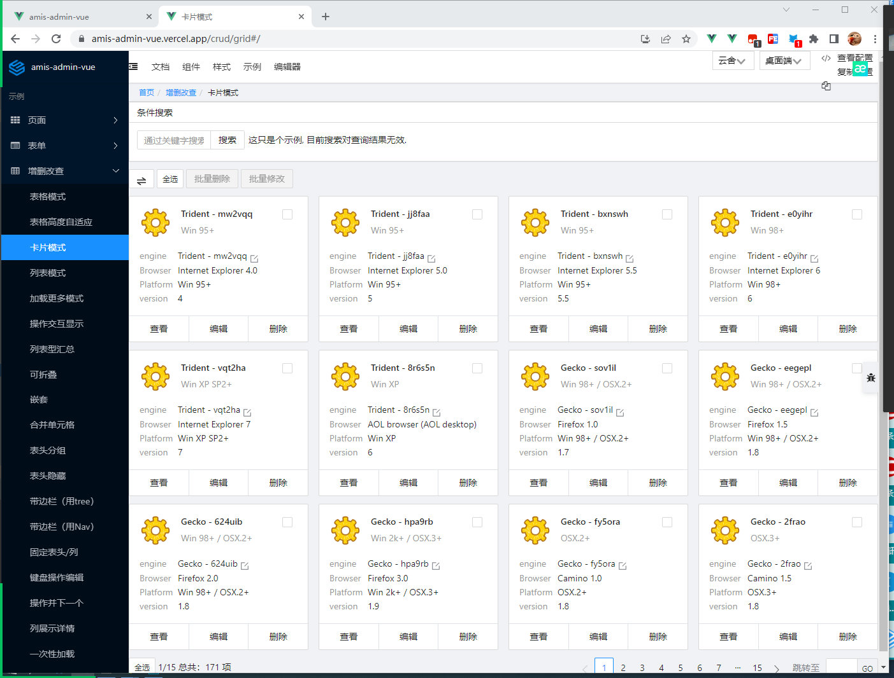
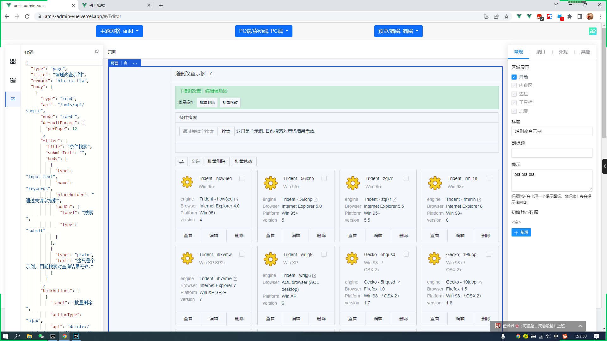

# amis-admin-vue

<div align="center">

[](https://github.com/h7ml/amis-admin-vue/actions/workflows/deploy.yml)
[](https://github.com/h7ml/amis-admin-vue/blob/master/LICENSE#L1)
[](https://github.com/h7ml/amis-admin-vue/blob/master/package.json#L36)
[](https://github.com/h7ml/amis-admin-vue/search?l=css)
[](https://github.com/h7ml/amis-admin-vue/commits)
[](https://amis.vercel.app/)
</div>

基于[amis](https://github.com/baidu/amis) 渲染器，快速搭建自己的管理系统。
这是基于官方应用模板[amis-admin](https://github.com/aisuda/amis-admin)的vue实现版本。
支持最新版本的[amis](https://github.com/h7ml/amis-admin-vue/blob/master/package.json#L3)

## [项目预览](https://amis-admin-vue.vercel.app/index)
[](https://amis.vercel.app/)
## [项目在线编辑器](https://amis-admin-vue.vercel.app/#/Editor)
[](https://amis.vercel.app/#/Editor)
## Project setup

```
npm install
```

### Compiles and hot-reloads for development

```
npm run serve
```

### Compiles and minifies for production

```
npm run build
```

### Lints and fixes files

```
npm run lint
```

### Customize configuration

See [Configuration Reference](https://cli.vuejs.org/config/).
